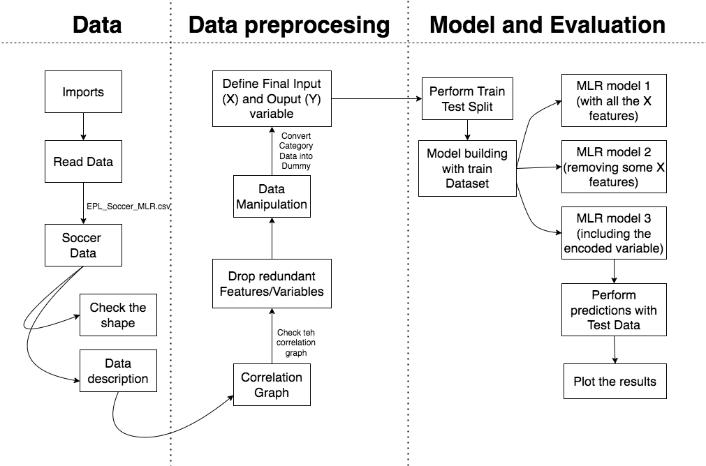

# Multi Linear Regresion model with Python

# Overview 
Our analytical exploration takes a decisive leap forward as we delve into the realm of Multi Linear Regression to unravel the intricate web of influences behind EPL soccer players' scores. This advanced statistical technique holds the key to deciphering the collective impact of multiple variables on player performance, presenting a comprehensive picture that extends beyond traditional analysis.

With a data-driven approach, we endeavor to discern how an ensemble of factors, ranging from physical attributes and gameplay strategies to psychological aspects, collectively shape a player's score. By constructing a multi-dimensional model that accounts for the intricate interplay of these variables, we unlock the potential to predict scores with heightened precision and depth. Yet, the significance of this exploration transcends the realm of sports. This predictive power bears profound implications for strategic decision-making, team composition, and game tactics – all of which ripple through the broader business landscape of sports management. By harnessing Multi Linear Regression, we embark on an intricate journey to uncover the complex synergy that underscores player performance, ushering in a new era of insight-driven strategies that bridge the gap between sportsmanship and astute business decisions within the realm of EPL soccer.

Before starting this project, please do visit the first project of the series:
[Linear Regression Model Project in Python](https://github.com/diegovillatoromx/linear_regresion_with_python).

# Aim
To build a multiple linear regression model in python.

# Approach
- Import the required libraries and dataset
- Check for the correlation between features
- Plot a graph for correlations
- Remove the weakly correlated and highly multicollinear variables
- Perform train test split on the dataset
- Fit the multiple linear regression model
- Convert categorical variables into dummy/indicator variables
- Plot the results

## Tech Stack
* Language: Python
* Libraries: pandas, statsmodel, seaborn, matplotlib, sklearn, scipy

## Data Description

The dataset used is the soccer player dataset. It has information about various players
from different clubs, and it provides data over ten features with a number of goals as the
target variable. There are total 202 rows and 13 columns in [EPL Soccer Dataset](https://github.com/diegovillatoromx/Multi_Linear_Regresion_with_Python/blob/main/EPL_Soccer_MLR_LR.csv).

## Architecture Diagram

## Complete Tutorial
I have created a detailed [notebook](https://github.com/diegovillatoromx/Multi_Linear_Regresion_with_Python/blob/main/MLR_python.ipynb) tutorial for this project, where you will execute everything from start to end.
